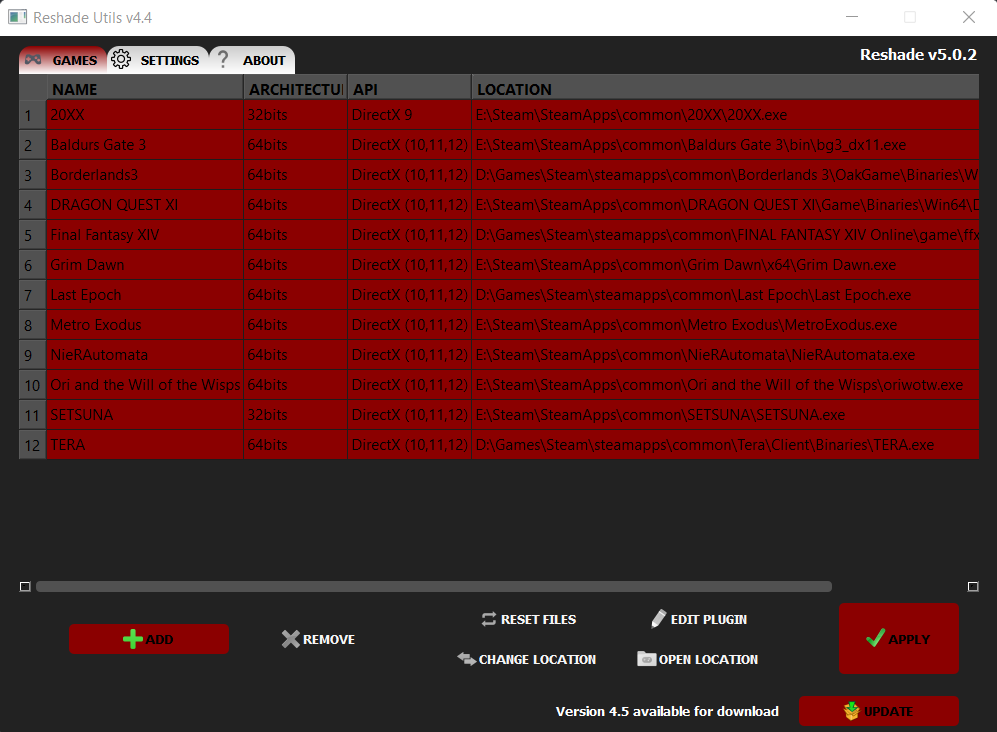
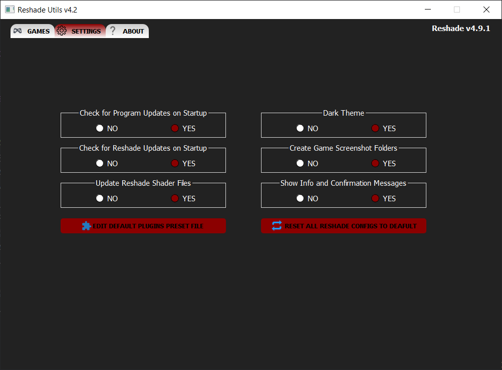

# Reshade Utilities
### Program to copy/update [Reshade](https://reshade.me/) DLLs and shaders

## Download
+ [Latest Release](https://github.com/ddc/ReshadeUtils/releases/latest)

## Program Notes
+ Configuration, logs and database files are now being saved in "%LOCALAPPDATA%\ReshadeUtils"
+ This program was compiled with PyInstaller

## To compile
+ Install requirements:
    + pip install -r requirements.txt
+ Compile both launcher and program with PyInstaller:
    + python.exe -O -m PyInstaller -y --clean ./resources/spec/launcher.spec
    + python.exe -O -m PyInstaller -y --clean ./resources/spec/reshadeUtils.spec

## Acknowledgements
+ [PyQt5](https://riverbankcomputing.com/software/pyqt)
+ [Python3](https://www.python.org)
+ [Reshade](https://reshade.me)
+ [PyInstaller](https://www.pyinstaller.org)
+ [Inno Setup](http://www.innosetup.com)

## License
Released under the [GNU GPL v3](LICENSE)

## Buy Me a Cup of Coffee
This program is open source and always will be, even if I don't get donations. That said, I know there are people out there that may still want to donate just to show their appreciation so this is for you guys. Thanks in advance!

