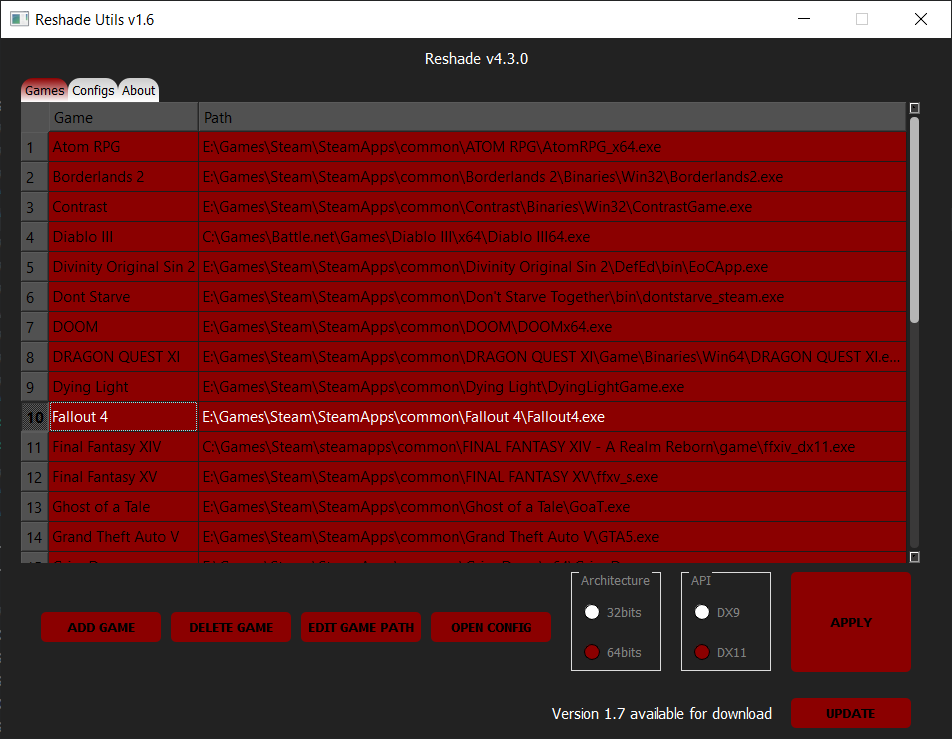

# Reshade Utilities

Program to copy/update [Reshade](https://reshade.me/) DLLs and shaders to several games at once.

## Download
+ [Latest Release](https://github.com/ddc/ReshadeUtils/releases/latest)

## Program Notes
+ Configuration, logs and database files will be saved inside "%APPDATA%\ReshadeUtils"
+ This program was compiled with PyInstaller

## To compile
+ Install requirements:
    + pip install -r requirements.txt
+ Compile with PyInstaller both launcher and program:
    + python3 -O -m PyInstaller --uac-admin --clean -y -F Launcher.spec
    + python3 -O -m PyInstaller --uac-admin --clean -y -F ReshadeUtils.spec

## Acknowledgements
+ [QT5](https://www.qt.io)
+ [Python3.6+](https://www.python.org/downloads/)
+ [Reshade](https://reshade.me/)
+ [Inno Setup](http://www.innosetup.com/)

## License
Released under the [GNU GPL v3](LICENSE).

## Buy Me a Cup of Coffee
This program is open source and always will be, even if I don't get donations. That said, I know there are people out there that may still want to donate just to show their appreciation so this is for you guys. Thanks in advance!

