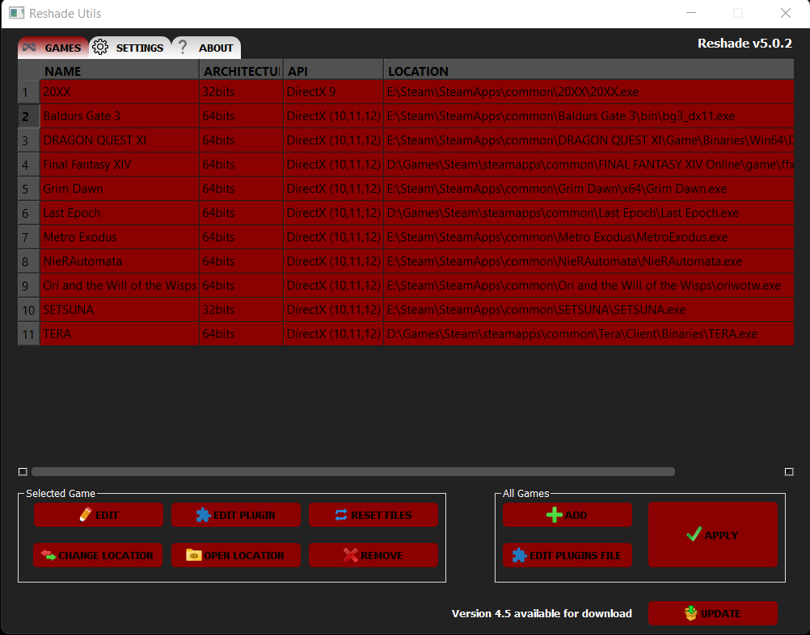
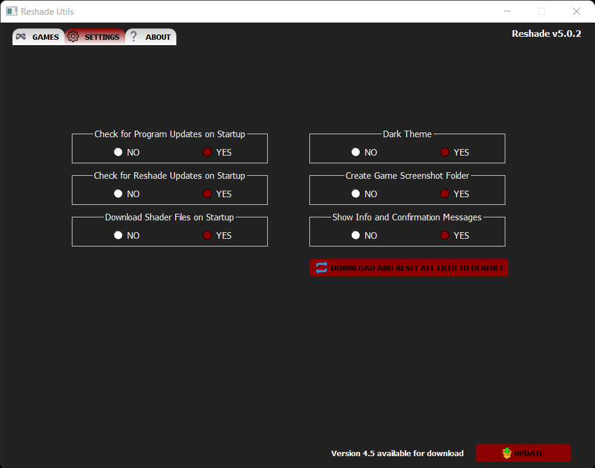

# ReShade Utilities
## Program to copy/update [ReShade](https://reshade.me/) DLLs and shaders

[//]: # ([![codecov]&#40;https://codecov.io/gh/ddc/ReShadeUtils/graph/badge.svg?token=VG5O44966P&#41;]&#40;https://codecov.io/gh/ddc/ReShadeUtils&#41;)

# Download
+ [Latest Release](https://github.com/ddc/ReshadeUtils/releases/latest)

# Program Notes
+ Configuration, logs and database files are now being saved in "%LOCALAPPDATA%\ReShadeUtils"
+ This program was compiled with PyInstaller

# Run tests and Get coverage report
+ poe test

# To compile using PyInstaller
+ Compile both launcher and program with PyInstaller:
    + python -O -m PyInstaller -y --clean --log-level INFO --workpath ./dist/build --distpath ./dist ./src/data/spec/launcher.spec
    + python -O -m PyInstaller -y --clean --log-level INFO --workpath ./dist/build --distpath ./dist ./src/data/spec/reshadeUtils.spec

# Acknowledgements
+ [PyQt6](https://riverbankcomputing.com/software/pyqt)
+ [Python3](https://www.python.org)
+ [Reshade](https://reshade.me)
+ [PyInstaller](https://www.pyinstaller.org)
+ [Inno Setup](http://www.innosetup.com)

# License
Released under the [GNU GPL v3](LICENSE)

# Buy me a cup of coffee
+ [GitHub Sponsor](https://github.com/sponsors/ddc)
+ [ko-fi](https://ko-fi.com/ddcsta)
+ [Paypal](https://www.paypal.com/ncp/payment/6G9Z78QHUD4RJ)
